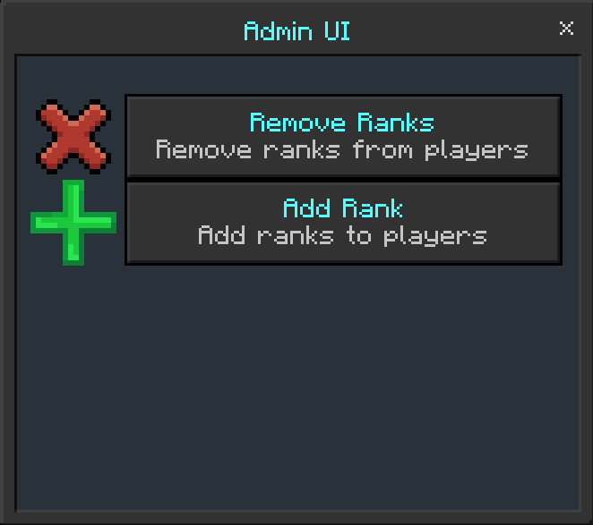

# Chat ranks

You can add chat ranks to yourself with the Ranks UI or /tag.
## Methods:

### Tags
- `/tag @s add "simplerank:Example rank"`
- `/tag @s add "simple-nc:§b"`
- `/tag @s add "simple-cc:§b"`

It will look like this:

### Ranks UI

You can add ranks easily with the Ranks UI

Get the [Admin UI](/docs/tutorial-basics/getting_admin_panel) and navigate to "Admin Tools" > "Rank UI"

Name colours and chat colours are only supported on tags as of 0.1.6