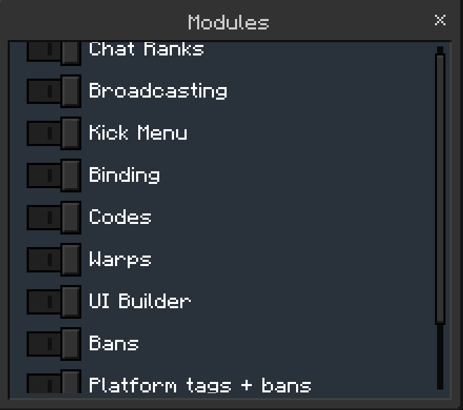

# Changing the modules

You can change how Simple Essentials behaves in the Modules UI.

You can toggle the Binding System, Ban System, Lore System, Chat Ranks, Platform Bans + Tags, and more!

## Navigation
Go to:
- [Admin UI](/docs/tutorial-basics/getting_admin_panel)
- Main Settings
- Modules

## Screenshot
