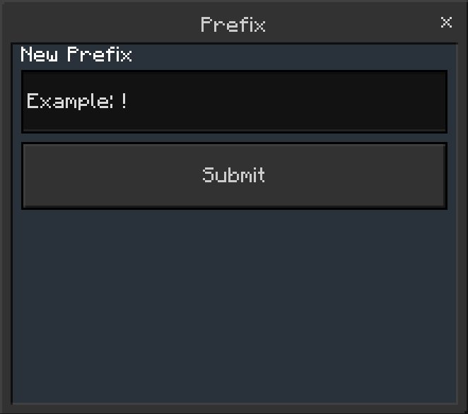

# Changing the prefix

You can change the prefix in Simple Essentials by navigating to:
- [Admin UI](/docs/tutorial-basics/getting_admin_panel.mdx)
- Main Settings
- Prefix

Here's what the UI looks like:

