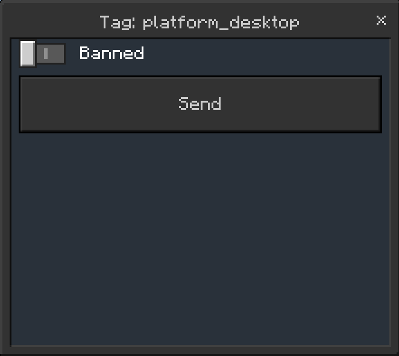
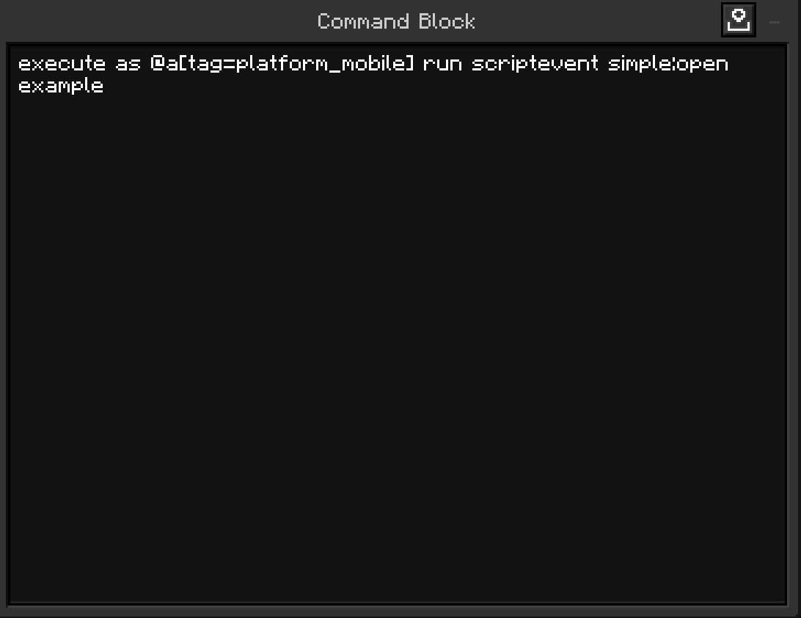

# Platform Tags & Bans

Platform Tags and Bans are really easy to use, here's how!

## Platform bans
In Simple Essentials, you can ban platforms from your server very easily.

All you need to do is navigate to:
- Main settings
- Platform settings
- Platform of your choice
- Toggle `Banned` and click `Send`.

## Platform tags
In Simple Essentials, platform tags are really easy to use.

You could even create your own Simple Essentials extension to execute code if you have a Platform Tag.

All you need to do is check if the player has the tag "platform_platformofchoice" and that's it!

You could even make your own custom Platform Ban UI and spam it at the player if they are on the platform. That would create loads of possibilites like a Platform Whitelist!

