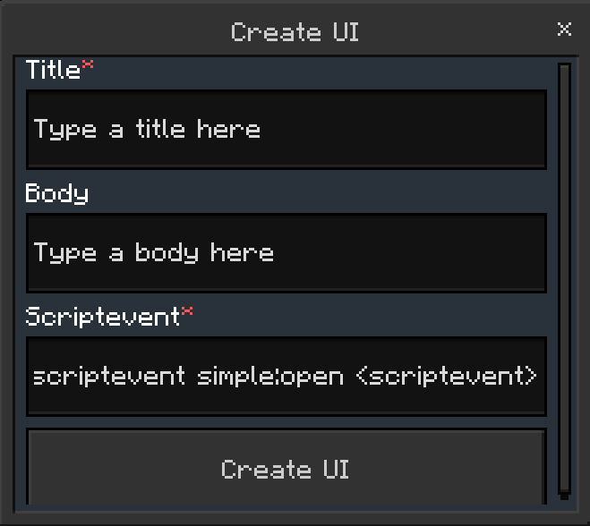
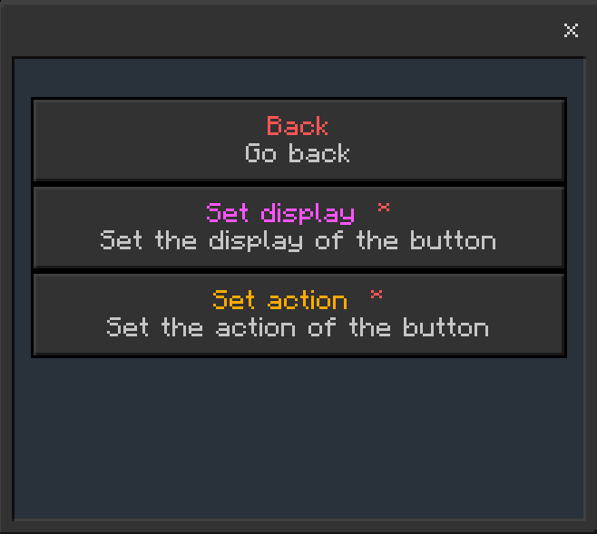
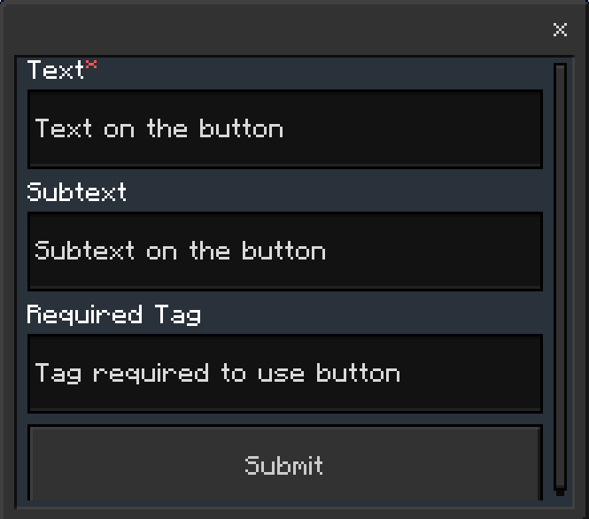
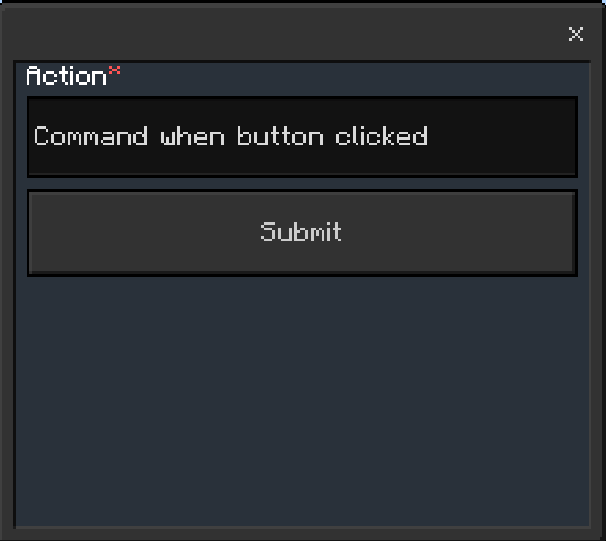

# UI Builder
The UI Builder is the most advanced feature in Simple Essentials. Here's how to use it!

## Navigation
You can navigate to the UI Builder by going to:
- [Admin UI](/docs/tutorial-basics/getting_admin_panel.mdx)
- Main Settings
- UI Builder

## How to use the UI Builder
To add a UI, click `Add UI`.

Fill out the form

| Option                 | Description                    |
| ------------------- | ------------------------------ |
| `Title`                | The title        |
| `Body`                | Text below the title       |
| `Scriptevent`              | Only fill the name, not `scriptevent simple:open example`  |

## Buttons

To add a button, click `Edit Buttons`, then click `Add button`

| Option                 | Description                    |
| ------------------- | ------------------------------ |
| `Display`                | The button's display        |
| `Action`                | What happens when you click the button.       |

### Display:

| Option                 | Description                    |
| ------------------- | ------------------------------ |
| `Text`                | The button's text        |
| `Subtext`                | The text under the button's text      |
| `Required tag`                | The required tag to see the button      |

### Action:

| Option                 | Description                    |
| ------------------- | ------------------------------ |
| `Command`                | The button's click event (Uses mcbe command syntax)        |

